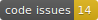

# Catalog
<h4 align="center">A catalog datatype for MATLAB - A catalog is a collection of unique, named and ordered items.</h4>

<h4 align="center">
  
    
  
  
  
</h4>

## Class Description

This class is something of a hybrid between a dictionary and a table. The main idea is that it will hold unique items, where an item is a structure or an object with a set of fields (properties).

### Key Differences from a Table with Row Entries:

- All items should be named (items can be renamed).
- All items will have a universal unique identifier (uuid) which should never change.
- Items are ordered (and reorderable), and items can be retrieved by their row number.

## Installation
Install from MATLAB's Addon Manager or clone this repository.
